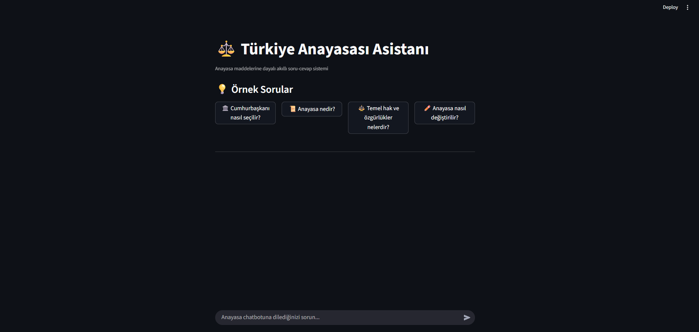
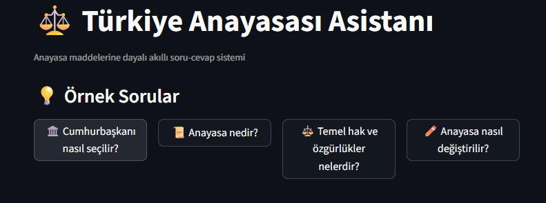
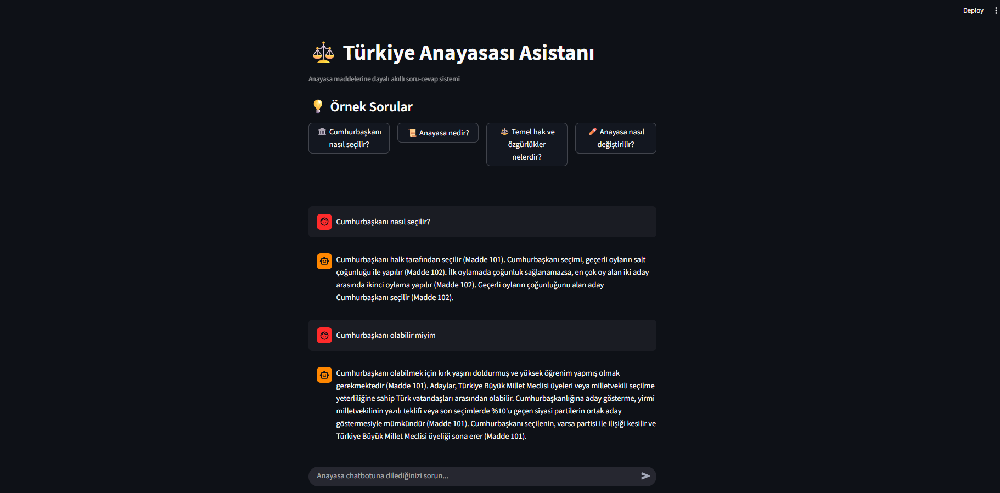

# ⚖️Türkiye Cumhuriyeti Anayasası RAG Chatbot

Bu proje, RAG (Retrieval Augmented Generation) teknolojisi kullanarak Türkiye Cumhuriyeti Anayasası metni üzerinde akıllı soru-cevap sistemi geliştiren bir chatbot uygulamasıdır.

## 📋 1. Proje Amacı
Bu chatbot uygulaması, vatandaşların, hukuk öğrencilerinin ve araştırmacıların Türkiye Cumhuriyeti Anayasası hakkındaki sorularını hızlı ve doğru bir şekilde yanıtlamayı amaçlamaktadır. RAG mimarisi sayesinde, anayasa maddelerine dayalı güvenilir ve kaynak gösterebilen yanıtlar üretir.

## 📊 2. Veri Seti

### Veri Seti Hakkında Bilgi
- **Kaynak**: Türkiye Cumhuriyeti Anayasası (Resmi Metin)
- **Format**: UTF-8 kodlamalı metin dosyası (anayasa.txt)
- **İçerik**: 176 madde ve başlangıç metni
- **Boyut**: Yaklaşık 500KB metin verisi
- **Dil**: Türkçe

### Veri Hazırlık Metodolojisi
1. **Kaynak Doğrulama**: Resmi mevzuat sitesinden alınan güncel anayasa metni
2. **Metin İşleme**: Regex kullanarak "Madde X –" desenine göre otomatik bölümleme
3. **Doküman Yapılandırma**: Her madde ayrı Document objesi olarak işleme
4. **Metadata Ekleme**: Madde numarası ve kaynak bilgisi ile etiketleme

```python
# Veri işleme örneği
madde_metinleri = re.split(r'(Madde \d+ –)', full_text)
anayasa_docs = []
for i in range(1, len(madde_metinleri), 2):
    madde_basligi = madde_metinleri[i].strip()
    madde_icerigi = madde_metinleri[i+1].strip()
    content = f"{madde_basligi}\n{madde_icerigi}"
    anayasa_docs.append(Document(content=content, meta={"kaynak": "anayasa.txt", "madde": madde_basligi}))
```

## 🚀 3. Kodunuzun Çalışma Kılavuzu

### Gereksinimler
- Python 3.8+
- Google API Key (Gemini için)

### Kurulum Adımları

1. **Repository Klonlama**
```bash
git clone [repository-url]
cd anayasa_chatbot
```

2. **Virtual Environment Kurulumu**
```bash
# Windows
python -m venv venv
venv\Scripts\activate

# Linux/Mac
python -m venv venv
source venv/bin/activate
```

3. **Dependencies Kurulumu**
```bash
pip install -r requirements.txt
```

4. **Environment Variables Ayarlama**
```bash
# .env dosyası oluşturun
cp .env.example .env
# .env dosyasına Google API anahtarınızı ekleyin
GOOGLE_API_KEY="your_api_key_here"
```

5. **Uygulamayı Çalıştırma**
```bash
streamlit run app.py
```

### requirements.txt İçeriği
```
streamlit>=1.28.0
python-dotenv>=1.0.0
haystack-ai>=2.17.1
sentence-transformers>=2.2.0
google-generativeai>=0.3.0
google-genai-haystack>=1.0.0
transformers>=4.30.0
torch>=2.0.0
```

### Proje Dosya Yapısı
```
anayasa_chatbot/
├── app.py                          # Ana Streamlit uygulaması
├── requirements.txt                # Python dependencies
├── .env.example                    # Environment variables şablonu
├── .gitignore                      # Git ignore kuralları
├── anayasa.txt                     # Anayasa metni veri seti
├── anayasa_chatbot_tutorial.ipynb  # Jupyter notebook tutorial
├── assets/                         # Video ve görseller
│   ├── demo_video.mp4              # Kullanım demo videosu
│   └── screenshots/                # Ekran görüntüleri
├── LICENSE                         # MIT Lisansı
└── README.md                       # Bu dosya
```

## 🏗️ 4. Çözüm Mimariniz

### Kullanılan Teknolojiler

#### Backend Stack
- **Haystack AI 2.x**: Modern RAG framework
- **Google Gemini 2.0 Flash**: Large Language Model (LLM)
- **SentenceTransformers**: Türkçe embedding modeli (`trmteb/turkish-embedding-model`)
- **InMemoryDocumentStore**: Vektör veritabanı

#### Frontend Stack
- **Streamlit**: Web framework ve UI

### Çözülen Problem
**Problem**: Türkiye Cumhuriyeti Anayasası 176 maddelik kapsamlı bir belgedir. Vatandaşlar, öğrenciler ve araştırmacılar belirli konularda hızlı bilgi almakta zorluk çekmektedir.

**Çözüm**: RAG tabanlı chatbot ile:
- Doğal dil ile soru sorabilme
- İlgili anayasa maddelerini otomatik bulma
- Kaynak gösterebilen güvenilir yanıtlar
- Kullanıcı dostu web arayüzü

### RAG Mimarisi İşleyişi

```mermaid
    A[Kullanıcı Sorusu] --> B[Text Embedder]
    B --> C[Similarity Search]
    C --> D[Document Retriever]
    D --> E[İlgili Maddeler]
    E --> F[Prompt Builder]
    F --> G[Google Gemini LLM]
    G --> H[Yanıt Üretimi]
    H --> I[Kullanıcıya Sunma]
```

### Pipeline Bileşenleri

1. **Text Embedding**: 
   - Model: `trmteb/turkish-embedding-model`
   - Türkçe için optimize edilmiş
   - 768 boyutlu vektör representation

2. **Document Retrieval**:
   - InMemory vector search
   - Cosine similarity ile en yakın 7 madde
   - Metadata ile filtreleme imkanı

3. **Prompt Engineering**:
```python
template = [
    ChatMessage.from_system(
        "Sen, yalnızca sağlanan Türkiye Anayasası metinlerini kullanarak soruları yanıtlayan bir asistansın."
        "Cevabını oluşturmak için SADECE aşağıda verilen belgeleri kullan."
    ),
    ChatMessage.from_user("""
        Belgeler:  {{ doc.content }} 
        Soru: {{question}}
        Yanıt:
    """)
]
```

4. **Generation**:
   - Model: Google Gemini 2.0 Flash
   - Temperature: 0.4 (tutarlı yanıtlar)
   - Top-p: 0.95 (çeşitlilik kontrolü)

### Performans Optimizasyonları
- **Caching**: `@st.cache_resource` ile model yükleme optimizasyonu
- **Lazy Loading**: İhtiyaç halinde component yükleme
- **Memory Management**: InMemory store ile hızlı erişim

## 🌐 5. Web Arayüzü & Product Kılavuzu

### Çalışma Akışı

#### 1. Ana Sayfa


Kullanıcılar karşılandıktan sonra:
- Sistem otomatik olarak anayasa metnini yükler
- Embedding modeli hazırlanır
- RAG pipeline aktif hale gelir

#### 2. Örnek Sorular


Hızlı test için hazır sorular:
- 🏛️ "Cumhurbaşkanı nasıl seçilir?"
- 📜 "Anayasa nedir?"
- ⚖️ "Temel hak ve özgürlükler nelerdir?"
- ✏️ "Anayasa nasıl değiştirilir?"

#### 3. Serbest Soru Sorma


Kullanıcılar:
- Doğal Türkçe ile soru sorabilir
- Gerçek zamanlı yanıt alabilir
- Chat geçmişi görüntüleyebilir

### 🎥 Demo Video

```markdown
🎥 **Demo Video**: [İzlemek için tıklayın](./assets/demo_video.mp4)
```

### 🔗 Deploy Linki
**Canlı Demo**: [Anayasa_Chatbot.app](https://anayasa-chatbot.streamlit.app)